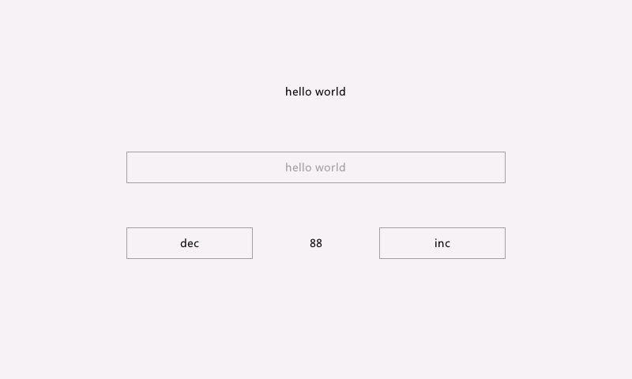
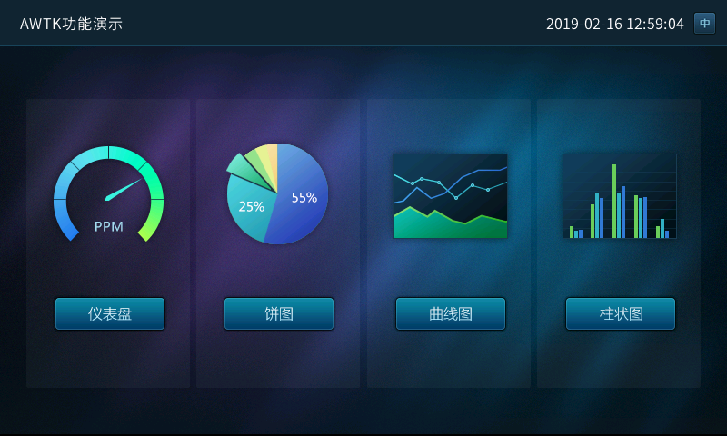

# AWTK 示例使用说明

#### 项目介绍：

- HelloWorld-Demo：最简单的入门 Demo，包含基本的文本和按钮控件使用方法
- HelloWorld.Xml-Demo：最简单的入门 Demo，演示如何使用 XML 方式设计界面
- CleanAir-Demo：新风系统演示 Demo
- Meter-Demo：普通工业仪表演示 Demo
- Chart-Demo：图表演示 Demo，包含仪表、饼图、曲线图、柱状图
- MusicPlayer-Demo：音乐播放器演示 Demo


#### 入门文档：

- docs/AWTK开发实践.pdf


#### Windows 使用方法：

1. 确保已经安装好 VS2015（Visual C++）、Python2.7、SCons 等工具

2. 将 awtk 和 awtk-examples 下载到同一个文件夹下

3. 修改 awtk 的 SConstruct 脚本使用 AGGE 渲染方式

   ```
   NANOVG_BACKEND='AGGE'
   ```

4. 进入 awtk 文件夹，在命令行中输入 scons 编译 awtk

   ```
   C:\zlgopen\awtk> scons
   ```

5. 进入 awtk-examples 中某个项目文件夹，在命令行中输入 scons 编译项目

   ```
   C:\zlgopen\awtk-examples\HelloWorld-Demo> scons
   ```

6. 进入项目的 bin 文件夹启动 demo

   ```
   C:\zlgopen\awtk-examples\HelloWorld-Demo\bin> demo.exe
   ```


#### AWorks 使用方法：

1. 打开已经配置好的 AWTK（Eclipse） 工程

2. 将上面某个 Demo 文件夹直接拷贝或拖放到工程目录下

3. 将其他 Demo 文件夹从工程中屏蔽（Exclude from Build）

   ```
   1. 在工程数中选中要屏蔽的 Demo 文件夹
   2. 右键菜单选中 Resource Configurations -> Exclude from Build...
   3. 弹出对话框点击 Select All -> OK
   ```

4. 编译工程

5. 下载到板子调试运行


> Eclipse 工程中的 awtk-demos 是 AWTK 的内置的示例，包含各种控件的使用方法
>
> 更详细的使用方法，请参考入门文档


#### 运行效果截图：






